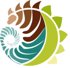

\hrule

MSc candidate in Biological Sciences at the [Dept. of Biological Sciences](http://www.biologicalsciences.uct.ac.za/), [University of Cape Town](http://www.uct.ac.za/), South Africa \hfill { width=24 } { width=24 }

I have broad interests in plant and animal phylogenetics systematics, community ecology, plant ecophysiology, climate change biology, statistical ecology, and computational and model-based methods. Striving for a career in research, academia and teaching.

@rvanmazijk on { width=12 } [Twitter](https://twitter.com/rvanmazijk) and { width=12 } [GitHub](https://github.com/rvanmazijk)

{ width=12 } <https://orcid.org/0000-0003-2659-6909>

{ width=12 } [LinkedIn](https://www.linkedin.com/in/ruan-van-mazijk-4a04b0127) { width=12 } [ResearchGate](https://www.researchgate.net/profile/Ruan_Van_Mazijk) { width=12 } [Mendeley](https://www.mendeley.com/profiles/ruan-van-mazijk)

\hfill \hrule

## Education

- **MSc candidate in Biological Sciences** _Cape Town_ \hfill 2018--present
  - Dissertation title: _Genome size effects on plant hydraulic ecophysiology, habitat and phenology_ 
    \par _in Cape Schoenoid sedges (Cyperaceae: Schoeneae)_
  - Principle supervisor: Associate Prof A.M. Muasya
  - Co-supervisors: Associate Prof G.A. Verboom and Associate Prof A.G. West
- **BSc Hons in Biological Sciences** _Cape Town_ \hfill 2017
  - Dissertation title: _Relating vascular plant species richness and environmental heterogeneity across spatial scales_ 
    \par _in the Greater Cape Floristic Region and the Southwest Australia Floristic Region_
  - Supervisors: Prof M.D. Cramer and Associate Prof G.A. Verboom
  - Graduated with distinction
- **BSc in Ecology & Evolution, Applied Biology** _Cape Town_ \hfill 2016
  - Distinction in both majors and the degree as a whole
- National Senior Certificate, Fairmont High School, Durbanville, South Africa \hfill 2013
  - Bachelor's Pass with honours and six distinctions

## Publications

### Popular articles

- Elliott, T.L., Laidler, G., Muasya, A.M., Muthaphuli, N. and **van Mazijk, R.** (In review). Foregrounding sedges: bringing the neglected Cape Schoenoid sedges to the forefront of genomic research. _Veld & Flora_.

### Peer-reviewed articles

- Cramer, M.D., Wootton, L.M., **van Mazijk, R.** and Verboom, G.A. (In review). Improved spatial soil data confirms dependence of vegetation distribution on edaphic properties in the Cape biodiversity hotspot. _Diversity & Distributions_.
- Shaik, Z., **van Mazijk**, R., Bergh, N.G., Verboom, G.A. and Cron, G. (In prep.). Contingent evolution of sexual systems and life histories in _Helichrysum_ (Asteraceae: Gnaphaleae).
- **Van Mazijk, R.**, Cramer, M.D. and Verboom, G.A. (In prep.). The role of environmental heterogeneity in determining plant species richness in the Greater Cape Floristic Region & the Southwest Australia Floristic Region. To submit to _Journal of Biogeography_.
- **Van Mazijk**, R., Smythe, L.K., Weideman, E.A. and West, A.G. (2018). Isotopic tracing of stormwater in the urban Liesbeek River. _Water SA_, 44(4):674--679. DOI: [10.4314/wsa.v44i4.16](http://dx.doi.org/10.4314/wsa.v44i4.16).

## Professional affiliations

- Southern African Society for Systematic Biology (SASSB) council member \hfill 2019--present<!--term ends end-2021-->
  \par Student Representative Portfolio
- SASSB student member \hfill 2018--present
- South African Association of Botanists (SAAB) student member \hfill 2017--present
- Golden Key International Honour Society member \hfill 2015--present

## Funding & awards

### Travel grants

- UCT Conference Travel Grant to attend the 45^th^ Annual SAAB, African Mycological Assocation (AMA)
  \par and SASSB Joint Congress, 2019 (R3,819) \hfill 2018

### Scholarships & bursaries

- Department of Science and Technology (DST) and National Research Foundation (NRF)
  \par Innovation Masters Scholarship (R90,000) \hfill 2019
- UCT Masters Research Scholarship (R30,000) \hfill 2019
  \par Awarded but not reimbursed due to award of DST-NRF Innovation Masters Scholarship 
- UCT Bursary Top Ups (R6,000 total) \hfill 2019
  \par from Associate Prof A.M. Muasya, Associate Prof A.G. West and Associate Prof G.A. Verboom
- SAAB MSc Student Bursary (inaugural recipient) (R20,000 p.a.) \hfill 2018, 2019
- UCT Dept. of Biological Sciences Dorothy Cameron Scholarship (R20,000) \hfill 2018
- UCT Once-Off Top Up Award (R5,520) \hfill 2018
- UCT Masters Research Scholarship (R30,000) \hfill 2018
- DST-NRF Innovation Honours Scholarship (R60,000) \hfill 2017
- SAAB Honours Scholarship (R10,000) \hfill 2017
- UCT Council Honours Merit Scholarship (R20,000) \hfill 2017
  \par Awarded but not reimbursed due to award of DST-NRF Innovation Honours Scholarship 
- UCT Science Faculty Scholarship (R15,000 p.a.) \hfill 2015, 2016

### Awards & honours

- SASSB Best MSc Presentation, at the 45^th^ Annual SAAB, AMA and SASSB Joint Congress \hfill January 2019
  \par (three-way tie, shared with with Zaynab Shaik (UCT/SANBI) and Devon Main (UJ))
- UCT Dean's Merit List \hfill 2014--2016
- UCT Dick & Dorothy Borcherds Prize for the highest standard in 2^nd^ year biology (R1,000) \hfill 2015
- Top of the class at UCT for:
  - 3^rd^ year evolutionary biology \hfill 2016
  - 2^nd^ year botany \hfill 2015
  - 2^nd^ year zoology \hfill 2015
  - 2^nd^ year marine biology \hfill 2015
  - 1^st^ year biological diversity \hfill 2014

## Leadership experience

- UCT Dept. of Biological Sciences Postgraduate Committee member \hfill October 2018--present
- UCT Departmental Representative for the Dept. of Biological Sciences \hfill 2016.
- Class Representative at UCT for:
  - 3^rd^ year evolutionary biology \hfill 2016
  - 3^rd^ year ecology \hfill 2016
  - 2^nd^ year botany \hfill 2015

## Teaching

- Teaching assistant for angiosperm diversity practicals \hfill October 2018
  - Lecturer: Associate Prof G.A. Verboom (UCT)
- Tutor for undergraduate study design and data analysis for scientists \hfill 2017--present
  - Convenor: Associate Prof R. Altwegg (UCT)
- Assistant tutor for short course _SEEC-ACCESS Introduction to statistical modelling & data analysis_ \hfill 18--20 July 2018
  - Organiser: Associate Prof R. Altwegg (UCT)
- Assistant tutor undergraduate R practicals \hfill 2016--2018
  - Convenor: Associate Prof R. Altwegg (UCT)
- Hot-seat tutor for mathematics for biology, earth and environmental sciences undergraduates \hfill 2015
  - Convenor: T. van Heerden (UCT)
  - Hot-seat organiser: Dr R. Moolman (UCT)

## Research assistance

- Field assistant for sampling _Schoenus_ spp. (Cyperaceae: Schoeneae) \hfill 2018
  - Specimens were used for genome-size analyses and taxonomic study
  - Supervisor: Dr T.L. Elliott (Université De Montréal) and Associate Prof A.M. Muasya (UCT)
- Laboratory assistant for _Schoenus_ spp. (Cyperaceae: Schoeneae) hydroponics pilot study \hfill 2018
  - Supervisor: Dr T.L. Elliott (Université De Montréal) and Associate Prof A.M. Muasya (UCT)
- Data processing assistant for assessing the current available data for the soils of the GCFR \hfill June 2016--present
  - with L.M. Wootton
  - Part of the _Biodiversity and Environmental Change in the Cape Floristic Region_ 
    \par research programme at the Dept. of Biological Sciences
  - Supervisor: Prof M.D. Cramer (UCT)
- Field assitant for monitoring _Mimetes_ spp. & _Leucospermumn_ spp. (Proteaceae) \hfill January--February 2017
  - Populations were on the Cape Peninsula
  - with L.M. Wootton
  - Supervisor: Dr J.A. Slingsby (SAEON Fynbos Node, SEEC)
- Laboratory and field assistant for legume symbiotic rhizobia culturing \hfill December 2015
  - Also involved plant collections and literature-derived rhizobial collection data processing
  - Supervisors: Dr M. Dludlu (University of Swaziland) and Associate Prof A.M. Muasya (UCT)

## Workshop & conference attendance

- Presenter at the 45^th^ Annual SAAB, AMA and SASSB Joint Congress \hfill 9--11 January 2019
  - First oral presentation:
  \par _Environmental turnover predicts plant species richness & turnover_,
  \par on my BSc Hons dissertation work and publication in prep. \hfill 9 January 2019 
  - Second oral presentation:
  \par _Larger genome size constrains water-use efficiency and phenology in Cape Schoenoid sedges_,
  \par on my MSc work \hfill 11 January 2019 
- Presenter at _UCT BioDay_ \hfill 30 November 2018
  - I presented my preliminary results for my MSc
    \par on the role of genome size in shaping Cape Schoenoid sedge physiology
- Attendee at [_satRday Cape Town_](https://capetown2018.satrdays.org) \hfill 17 March 2018
- Presenter at workshop _Biodiversity and Environmental Change in the Cape Floristic Region_ \hfill 24 January 2017
  - with L.M. Wootton
  - We presented a progress report on "Development of soil atlas for the Greater Cape Floristic Region"
  - Organiser: Associate Prof L. Gillson (UCT)
- Attendee at workshop _Spatial Point Process Modelling for Ecological Survey Data with "inlabru"_ \hfill 11--13 January 2017
  - Instructors: Prof D.L. Borchers, Dr J.B. Illian (CREEM, St Andrews University)
    \par and Dr F. Bachl (University of Edinburgh)

## Press releases & science communication

- Radio interview on _The John Maytham Show_, _Cape Talk_ (28 November 2018). [_Harvesting Storm Water_](URL).
- Interviewed for article for UCT News by Susan Segar (26 November 2018). [_Harvesting storm water from the Liesbeek River_](URL).
- Mentioned in article for UCT Faculty of Science press releases (November--December 2018). [_Tracing stormwater in the Liesbeeck River - students passion drives scientific discovery_](URL).
- Presenter at [_Pint of Science Cape Town_](http://pintofsciencesa.wixsite.com/pintofsciencesa/uct-planet-earth-16) \hfill 16 May 2018
  - I presented hypotheses concerning the role of genome size in plant water use and ecology

## Skills

- Extended experience with:
  - Apple macOS
  - Microsoft Windows
  - Microsoft Office
  - R, RStudio, RMarkdown, "tidyverse" packages
  - Git, GitHub
  - Statistical modelling, GIS (in R)
- Fluent in:
  - English
  - Afrikaans
- Animal Ethics Course certified by South African Veterinary Council \hfill April 2017
  - Completed as part of BSc Hons general coursework

## Miscellaneous

- Open Day volunteer for the Dept. of Biological Sciences \hfill 21 April 2018, 22 April 2017
- Botanical Society of South Africa (BotSoc) member \hfill 2017--present
- UCT Wine & Culture Society member \hfill 2016--present
- UCT Birding Club member \hfill 2016--2017
- Selected to give student feedback for curriculum-restructuring within the Dept. of Biological Sciences \hfill August 2016
  - Related to roles as Class/Dept. Representative---see above
  - Selected by: Associate Prof A.G. West (UCT)
- Selected to give student feedback for _Biology: How Life Works_ (2nd edition) \hfill May 2016
  - Morris et al., 2016. W.H. Freeman & Co., Macmillan Education
  - Selected by: Dr R. Kelly-Laubscher (University College Cork)
- _Cape Wine Ambassador_ qualification \hfill 2016
  - Conferred by: Clive Torr
- UCT Biological Society member \hfill 2015
- Two Oceans Aquarium _Young Biologist_ Volunteer \hfill 2013--2014

\hfill \hrule

## References

- Associate Prof G.A. Verboom \hfill <tony.verboom@uct.ac.za>, +27 21 650 3398
  - Dept. of Biological Sciences, UCT
  - Bolus Herbarium, UCT
- Prof M.D. Cramer \hfill <michael.cramer@uct.ac.za>, +27 21 650 2444
  - Dept. of Biological Sciences, UCT
- Associate Prof A.M. Muasya \hfill <muthama.muasya@uct.ac.za>, +27 21 650 3725
  - Head, Dept. of Biological Sciences, UCT
  - Director, Bolus Herbarium, UCT
- Associate Prof A.G. West \hfill <adam.west@uct.ac.za>, +27 21 650 3628 
  - Dept. of Biological Sciences, UCT
- Associate Prof R. Altwegg \hfill <res.altwegg@uct.ac.za>, +27 21 650 5750
  - Dept. of Statistical Sciences, UCT
  - Head, Centre for Statistics in Ecology, the Environment and Conservation (SEEC), UCT
- Prof T.A.J. Hedderson \hfill <terry.hedderson@uct.ac.za>, +27 21 650 4037
  - Dept. of Biological Sciences, UCT
  - Bolus Herbarium, UCT

\hfill \hrule
