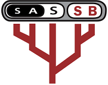

Ruan van Mazijk, *Curriculum vitae*
================

MSc candidate in Biological Sciences at the [Dept. of Biological Sciences](http://www.biologicalsciences.uct.ac.za/), [University of Cape Town](http://www.uct.ac.za/), South Africa

  

I have broad interests in plant and animal phylogenetics systematics, community ecology, plant ecophysiology, climate change biology, statistical ecology, and computational and model-based methods. Striving for a career in research, academia and teaching.

@rvanmazijk on  [Twitter](https://twitter.com/rvanmazijk) and  [GitHub](https://github.com/rvanmazijk)

 <https://orcid.org/0000-0003-2659-6909>

 [LinkedIn](https://www.linkedin.com/in/ruan-van-mazijk-4a04b0127)  [ResearchGate](https://www.researchgate.net/profile/Ruan_Van_Mazijk)  [Mendeley](https://www.mendeley.com/profiles/ruan-van-mazijk)

Education
---------

-   **MSc candidate in Biological Sciences** *Cape Town* 2018--present
    -   Dissertation title: *Genome size effects on plant hydraulic ecophysiology, habitat and phenology* *in Cape Schoenoid sedges (Cyperaceae: Schoeneae)*
    -   Principle supervisor: Associate Prof A.M. Muasya
    -   Co-supervisors: Associate Prof G.A. Verboom and Associate Prof A.G. West
-   **BSc Hons in Biological Sciences** *Cape Town* 2017
    -   Dissertation title: *Relating vascular plant species richness and environmental heterogeneity across spatial scales* *in the Greater Cape Floristic Region and the Southwest Australia Floristic Region*
    -   Supervisors: Prof M.D. Cramer and Associate Prof G.A. Verboom
    -   Graduated with distinction
-   **BSc in Ecology & Evolution, Applied Biology** *Cape Town* 2016
    -   Distinction in both majors and the degree as a whole
-   National Senior Certificate, Fairmont High School, Durbanville, South Africa 2013
    -   Bachelor's Pass with honours and six distinctions

Publications
------------

### Popular articles

-   Elliott, T.L., Laidler, G., Muasya, A.M., Muthaphuli, N. and **van Mazijk, R.** (In review). Foregrounding sedges: bringing the neglected Cape Schoenoid sedges to the forefront of genomic research. *Veld & Flora*.

### Peer-reviewed articles

-   Cramer, M.D., Wootton, L.M., **van Mazijk, R.** and Verboom, G.A. (In review). Improved spatial soil data confirms dependence of vegetation distribution on edaphic properties in the Cape biodiversity hotspot. *Diversity & Distributions*.
-   **Van Mazijk, R.**, Cramer, M.D. and Verboom, G.A. (In prep.). The role of environmental heterogeneity in determining plant species richness in the Greater Cape Floristic Region & the Southwest Australia Floristic Region. To submit to *Journal of Biogeography*.
-   **Van Mazijk**, R., Smythe, L.K., Weideman, E.A. and West, A.G. (2018). Isotopic tracing of stormwater in the urban Liesbeek River. *Water SA*, 44(4):674--679. DOI: [10.4314/wsa.v44i4.16](http://dx.doi.org/10.4314/wsa.v44i4.16).

<!--
- Shaik, Z., **van Mazijk**, R., Bergh, N.G., Verboom, G.A. and Cron, G. (In prep.). Contingent evolution of sexual systems and life histories in _Helichrysum_ (Asteraceae: Gnaphaleae).
-->
Professional affiliations
-------------------------

-   Southern African Society for Systematic Biology (SASSB) council member 2019--present<!--term ends end-2021--> Student Representative
-   SASSB student member 2018--present
-   South African Association of Botanists (SAAB) student member 2017--present
-   Golden Key International Honour Society member 2015--present

Funding & awards
----------------

### Travel grants

-   UCT Conference Travel Grant to attend the 45th Annual SAAB, African Mycological Assocation (AMA) and SASSB Joint Congress, 2019 (R3,819) 2018

### Scholarships & bursaries

-   Department of Science and Technology (DST) and National Research Foundation (NRF) Innovation Masters Scholarship (R90,000) 2019
-   UCT Masters Research Scholarship (R30,000) 2019 Awarded but not reimbursed due to award of DST-NRF Innovation Masters Scholarship
-   UCT Bursary Top Ups (R6,000 total) 2019 from Associate Prof A.M. Muasya, Associate Prof A.G. West and Associate Prof G.A. Verboom
-   SAAB MSc Student Bursary (inaugural recipient) (R20,000 p.a.) 2018, 2019
-   UCT Dept. of Biological Sciences Dorothy Cameron Scholarship (R20,000) 2018
-   UCT Once-Off Top Up Award (R5,520) 2018
-   UCT Masters Research Scholarship (R30,000) 2018
-   DST-NRF Innovation Honours Scholarship (R60,000) 2017
-   SAAB Honours Scholarship (R10,000) 2017
-   UCT Council Honours Merit Scholarship (R20,000) 2017 Awarded but not reimbursed due to award of DST-NRF Innovation Honours Scholarship
-   UCT Science Faculty Scholarship (R15,000 p.a.) 2015, 2016

### Awards & honours

-   SASSB Best MSc Presentation, at the 45th Annual SAAB, AMA and SASSB Joint Congress January 2019 (three-way tie, shared with with Zaynab Shaik (UCT/SANBI) and Devon Main (UJ))
-   UCT Dean's Merit List 2014--2016
-   UCT Dick & Dorothy Borcherds Prize for the highest standard in 2nd year biology (R1,000) 2015
-   Top of the class at UCT for:
    -   3rd year evolutionary biology 2016
    -   2nd year botany 2015
    -   2nd year zoology 2015
    -   2nd year marine biology 2015
    -   1st year biological diversity 2014

Leadership experience
---------------------

-   Southern African Society for Systematic Biology (SASSB) council member 2019--present<!--term ends end-2021--> Student Representative
-   UCT Dept. of Biological Sciences Postgraduate Committee member October 2018--present
-   UCT Departmental Representative for the Dept. of Biological Sciences 2016.
-   Class Representative at UCT for:
    -   3rd year evolutionary biology 2016
    -   3rd year ecology 2016
    -   2nd year botany 2015

Teaching
--------

-   Teaching and field assistant for second year ecology and evolution February 2019--present
    -   Convenor: Associate Prof G.A. Verboom (UCT)
-   Teaching assistant for second year angiosperm diversity practicals October 2018
    -   Lecturer: Associate Prof G.A. Verboom (UCT)
-   Tutor for second year study design and data analysis for scientists 2017--present
    -   Convenor: Associate Prof R. Altwegg (UCT)
-   Assistant tutor for short course *SEEC-ACCESS Introduction to statistical modelling & data analysis* 18--20 July 2018
    -   Organiser: Associate Prof R. Altwegg (UCT)
-   Assistant tutor first year R practicals 2016--2018
    -   Convenor: Associate Prof R. Altwegg (UCT)
-   Hot-seat tutor for first year mathematics for biology, earth and environmental sciences undergraduates 2015
    -   Convenor: T. van Heerden (UCT)
    -   Hot-seat organiser: Dr R. Moolman (UCT)

Research assistance
-------------------

-   Field assistant for sampling *Schoenus* spp. (Cyperaceae: Schoeneae) 2018
    -   Specimens were used for genome-size analyses and taxonomic study
    -   Supervisor: Dr T.L. Elliott (Université De Montréal) and Associate Prof A.M. Muasya (UCT)
-   Laboratory assistant for *Schoenus* spp. (Cyperaceae: Schoeneae) hydroponics pilot study 2018
    -   Supervisor: Dr T.L. Elliott (Université De Montréal) and Associate Prof A.M. Muasya (UCT)
-   Data processing assistant for assessing the current available data for the soils of the GCFR June 2016--present
    -   with L.M. Wootton
    -   Part of the *Biodiversity and Environmental Change in the Cape Floristic Region* research programme at the Dept. of Biological Sciences
    -   Supervisor: Prof M.D. Cramer (UCT)
-   Field assitant for monitoring *Mimetes* spp. & *Leucospermumn* spp. (Proteaceae) January--February 2017
    -   Populations were on the Cape Peninsula
    -   with L.M. Wootton
    -   Supervisor: Dr J.A. Slingsby (SAEON Fynbos Node, SEEC)
-   Laboratory and field assistant for legume symbiotic rhizobia culturing December 2015
    -   Also involved plant collections and literature-derived rhizobial collection data processing
    -   Supervisors: Dr M. Dludlu (University of Swaziland) and Associate Prof A.M. Muasya (UCT)

<!-- I contributed to the West Lab/ACCESS/SEEC data management policy document -->
Workshop & conference attendance
--------------------------------

-   Presenter at the 45th Annual SAAB, AMA and SASSB Joint Congress 9--11 January 2019
    -   First oral presentation: *Environmental turnover predicts plant species richness & turnover*, on my BSc Hons dissertation work and publication in prep. 9 January 2019
    -   Second oral presentation: *Larger genome size constrains water-use efficiency and phenology in Cape Schoenoid sedges*, on my MSc work 11 January 2019
-   Presenter at *UCT BioDay* 30 November 2018
    -   I presented my preliminary results for my MSc on the role of genome size in shaping Cape Schoenoid sedge physiology
-   Attendee at [*satRday Cape Town*](https://capetown2018.satrdays.org) 17 March 2018
-   Presenter at workshop *Biodiversity and Environmental Change in the Cape Floristic Region* 24 January 2017
    -   with L.M. Wootton
    -   We presented a progress report on "Development of soil atlas for the Greater Cape Floristic Region"
    -   Organiser: Associate Prof L. Gillson (UCT)
-   Attendee at workshop *Spatial Point Process Modelling for Ecological Survey Data with "inlabru"* 11--13 January 2017
    -   Instructors: Prof D.L. Borchers, Dr J.B. Illian (CREEM, St Andrews University) and Dr F. Bachl (University of Edinburgh)

Press releases & science communication
--------------------------------------

-   Radio interview on *The John Maytham Show*, *Cape Talk* (28 November 2018). [*Harvesting Storm Water*](URL).
-   Interviewed for article for UCT News by Susan Segar (26 November 2018). [*Harvesting storm water from the Liesbeek River*](URL).
-   Mentioned in article for UCT Faculty of Science press releases (November--December 2018). [*Tracing stormwater in the Liesbeeck River - students passion drives scientific discovery*](URL).
-   Presenter at [*Pint of Science Cape Town*](http://pintofsciencesa.wixsite.com/pintofsciencesa/uct-planet-earth-16) 16 May 2018
    -   I presented hypotheses concerning the role of genome size in plant water use and ecology

Skills
------

-   Extended experience with:
    -   Apple macOS
    -   Microsoft Windows
    -   Microsoft Office
    -   R, RStudio, RMarkdown and related packages, "tidyverse" packages
    -   Git, GitHub
    -   Statistical modelling, GIS (in R)
-   Fluent in:
    -   English
    -   Afrikaans
-   Animal Ethics Course certified by South African Veterinary Council April 2017
    -   Completed as part of BSc Hons general coursework

Miscellaneous
-------------

-   Open Day volunteer for the Dept. of Biological Sciences 21 April 2018, 22 April 2017
-   Botanical Society of South Africa (BotSoc) member 2017--present
-   UCT Wine & Culture Society member 2016--present
-   UCT Birding Club member 2016--2017
-   Selected to give student feedback for curriculum-restructuring within the Dept. of Biological Sciences August 2016
    -   Related to roles as Class/Dept. Representative---see above
    -   Selected by: Associate Prof A.G. West (UCT)
-   Selected to give student feedback for *Biology: How Life Works* (2nd edition) May 2016
    -   Morris et al., 2016. W.H. Freeman & Co., Macmillan Education
    -   Selected by: Dr R. Kelly-Laubscher (University College Cork)
-   *Cape Wine Ambassador* qualification 2016
    -   Conferred by: Clive Torr
-   UCT Biological Society member 2015
-   Two Oceans Aquarium *Young Biologist* Volunteer 2013--2014

References
----------

-   Associate Prof G.A. Verboom , +27 21 650 3398
    -   Dept. of Biological Sciences, UCT
    -   Bolus Herbarium, UCT
-   Prof M.D. Cramer , +27 21 650 2444
    -   Dept. of Biological Sciences, UCT
-   Associate Prof A.M. Muasya , +27 21 650 3725
    -   Head, Dept. of Biological Sciences, UCT
    -   Director, Bolus Herbarium, UCT
-   Associate Prof A.G. West , +27 21 650 3628
    -   Dept. of Biological Sciences, UCT
-   Associate Prof R. Altwegg , +27 21 650 5750
    -   Dept. of Statistical Sciences, UCT
    -   Head, Centre for Statistics in Ecology, the Environment and Conservation (SEEC), UCT
-   Prof T.A.J. Hedderson , +27 21 650 4037
    -   Dept. of Biological Sciences, UCT
    -   Bolus Herbarium, UCT
